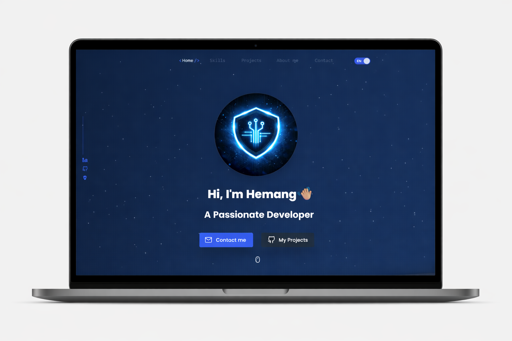
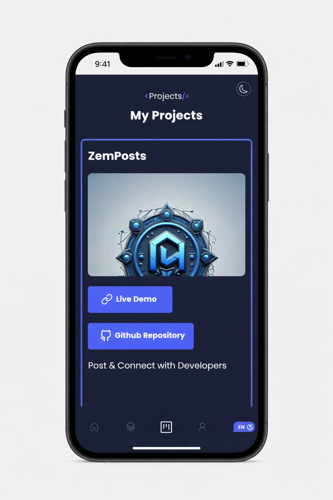

<p align = "center">
  
</p>

<h1 align = "center">

  PORTFOLIO V2 - [Website](https://zemerik.vercel.app)

</h1>

<div align = "center">




</div>


## ABOUT:


Welcome to Portfolio V2 — a showcase of my web development journey and modern frontend skills. Built with React, TypeScript, and Tailwind CSS, the site features advanced animations, multilingual support, and beautiful responsiveness for any device.

See the live site: [https://zemerik.vercel.app](https://zemerik.vercel.app)

## FEATURES:

- **Beautiful, Modern UI:** Clean design with glassmorphism, elegant gradients, soft shadows, and seamless responsiveness for all devices.
- **Animated About Me Section:** Includes an interactive coding laptop illustration, highlighting your personality and interests with micro-animations and rewritten engaging content.
- **Multi-Language Support:** Instantly switch between German and English with a simple toggle.
- **Live Projects Carousel:** Drag-and-scroll project showcase cards, updating automatically to reflect your latest work.
- **Achievements as Code Snippets:** Your technical milestones and skill highlights are presented as styled and interactive code cards.
- **Framer Motion Animations:** Subtle section transitions, hover effects, and attention-grabbing highlights for a dynamic user experience.
- **Tailwind CSS Styling:** Fast, easy theming and customization supporting dark/light/modern color schemes.
- **Quotes Slider:** Inspirational and tech-related quotes slider powered by Swiper.js.
- **One-click Contact:** Direct email/messaging option for easy communication.
- **Mobile-First:** Optimized layouts and performance for mobile users and touch interactivity.

<p align="center">
  
</p>

## USAGE:

- **Clone this repository:**

```
git clone https://github.com/Zemerik/Portfolio-v2
```

- **Navigate to the project directory:**

```
cd Portfolio-v2
```

> [!Important]
> You need to have [nodeJS](https://nodejs.org/en) installed

- **Start the development server:**

```nodejs
npm run dev
```

> **Tip:**
> Most site content is managed from the `data.tsx` file in `src/assets/lib/`. Customize site icons in `index.html`.


> [!Caution]
> Distribution or Use of any Personal Information is not allowed in any form. 

## CONTRIBUTING:

Contributions and feedback are welcome! Feel free to open issues or pull requests for features, improvements, or bug fixes.


<h1 align = "center">
  Thanks for Visiting🙏
</h1>

<p align = "center">
  Don't forget to leave a ⭐
  <br>
  Made with 💖 by <a href = "https://github.com/Zemerik">Hemang Yadav (Zemerik)</a>
</p>
