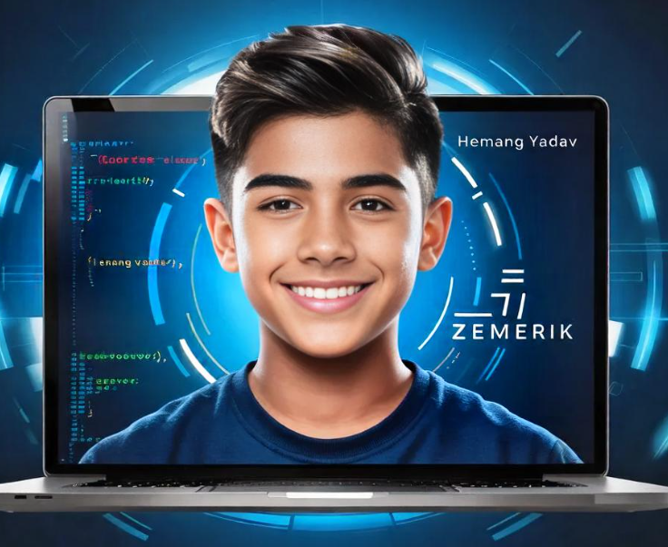
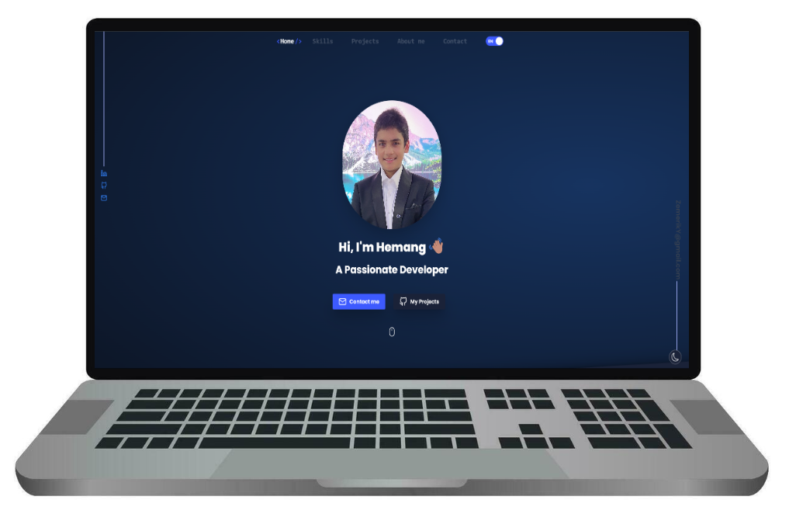
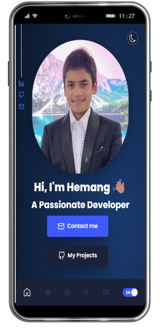

<p align = "center">



</p>

<h1 align = "center">

  PORTFOLIO V2 - [Website](https://zemerik.vercel.app)

</h1>

<div align = "center">




</div>

## ABOUT:


Here is the latest version of my portfolio, crafted using HTML, CSS, JavaScript, TypeScript, React, and Tailwind. This update highlights my proficiency with modern web technologies, featuring a sleek and responsive design. The integration of React and Tailwind enhances the user experience with seamless interactivity and aesthetics. Vercel has been used for Deploying this Project. 

View my Website here - https://zemerik.vercel.app

## FEATURES:

<table align = "center">
  <tr>
    <td>
      🎩 Responsive Navbar with Icons and hover effects
      <br>
      <br>
      🤯 Option to Switch between German and English Language
      <br>
      <br>
      ⚡ Tailwind Effects for Quotes and other text / animations
      <br>
      <br>
      🏆 Dragable and Self - Updating Project Cards
      <br>
      <br>
      📝 Code Snippets Outlining Achievements and Milestones
      <br>
      <br>
      ✈️ Mailing / Messaging Option
    </td>
    <td>

  
    </td>
  </tr>
</table>

## USAGE:

- Make a local copy of this Repository on your Machine through the following Git Command:

```
git clone https://github.com/Zemerik/Portfolio-v2
```

- Navigate to the Project Directory by the command below:

```
cd Portfolio-v2
```

> [!Important]
> You need to have [nodeJS](https://nodejs.org/en) installed

- Start the Development Server by the following commmand:

```nodejs
npm run dev
```

> [!Tip]
> All of your changes can be made in the `data.tsx` file located in `src/assets/lib/` directory, while the favicon can be altered in the `index.html` file. 

> [!Caution]
> Distribution or Use of any Personal Information is not allowed in any form. 

## CONTRIBUTING:

Contributions are always welcome and appreciated. Feel free to create an Issue or Pull - Request for any fixes, bug reports, feature request or more. 

<h1 align = "center">
  Thanks for Visiting🙏
</h1>

<p align = "center">
  Don't forget to leave a ⭐
  <br>
  Made with 💖 by <a href = "https://github.com/Zemerik">Hemang Yadav (Zemerik)</a>
</p>
